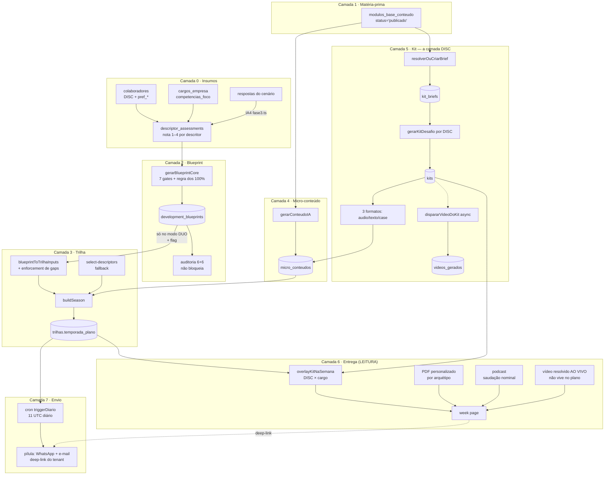

# Pipeline da Trilha — do assessment ao conteúdo personalizado

Mapa ponta a ponta de como uma trilha (Temporada) é construída: pré-requisitos, fontes,
produto e onde cada coisa persiste. **Escrito lendo o código** (17/07/2026; revisto 28/07/2026);
cada afirmação carrega `arquivo:linha`. Onde o código não decide, está marcado **não determinado**.

> **A regra que governa este documento:** várias camadas resolvem a entrega na **LEITURA**,
> não no que está gravado. Ao investigar "o que a pessoa recebe", leia **quem consome** — não
> a tabela. Ver `CLAUDE.md` › "a forma GRAVADA ≠ o que é ENTREGUE".

> **Errata 17/07/2026** (verificação completa: `docs/FMEA-PIPELINE.md` §6) — **incorporada ao corpo em 28/07/2026**:
> 1. Kit gera **3 formatos** (`['audio','texto','case']`, `actions/kits.ts`), não 4 — o vídeo do kit não é micro_conteudo (é `dispararVideoDoKit` → `videos_gerados`). Real: **12 micro_conteudos + 4 vídeos de célula** por brief.
> 2. ~~O "gate real na leitura" (`checarGatesSemana`) só existe nas 4 rotas de chat — `loadTemporada` e a week page **não gateiam**: semana futura é legível por URL direta~~ ✅ **20/08/2026** (`7ea60717`): a week page passou a gatear **e a explicar**. ⚠️ Este item ficou **34 dias** aberto aqui e só virou trabalho quando uma colaboradora reclamou por WhatsApp — achado sem consequência visível não é priorizado. `loadTemporada` segue sem gate de propósito (a leitura traz o plano inteiro; quem nega é a tela).
> 3. ~~"Idempotente por dia" omite: o carimbo `ultima_pilulaN_em` grava **mesmo com os 2 canais falhando** (`cron-jobs.ts:370`) — perda permanente, sem retry~~ ✅ **27/07**: o carimbo passou a ser **POR CANAL** (`lib/notifications/carimbo-canal.ts`) — canal sem sucesso não carimba e o dia segue pendente; + lock diário de execução (mig 187).
> 4. "Nunca quebra a entrega" tem exceções: PDF sem genérico → JSON 404 cru; podcast sem TTS nem áudio-base → 404 player mudo.
> 5. Caminhos: `lib/kit/*` → `lib/season-engine/kit/*` (corpo já usa o caminho completo; números de linha pontuais revistos).
> 6. `evolucao-granular.ts` não escreve DISC (lê `perfil_dominante` para projeção; o upsert é em `evolucao_descritores`). Escritores reais: `simulador-disc.ts` (demo) e import externo.
> 7. WhatsApp tem failover Z-API→WaSender (`lib/whatsapp/index.ts`; primário via `WHATSAPP_PRIMARY`, default `zapi`); `drift = fails > 0` está em `audit.ts:289`.

---

## Mapa geral



---

## Camada 0 — Insumos (o que precisa existir antes de tudo)

| Insumo | Onde vive | Quem produz | Obrigatório? |
|---|---|---|---|
| Colaborador | `colaboradores` (`nome_completo`, `cargo`, `empresa_id`) | cadastro / import | **sim** |
| **DISC** | `colaboradores`: `perfil_dominante`, `d/i/s/c_natural`, `lid_*` | `actions/simulador-disc.ts` (simulação demo), import externo — `actions/evolucao-granular.ts` só **lê** o DISC (projeção; o upsert dela é em `evolucao_descritores`) | **não** p/ blueprint (`lib/blueprint/core.ts:149`); **sim** p/ Kit |
| Preferência de formato | `colaboradores.pref_*` (likert 1–5) | cadastro | não (default vídeo) |
| **Foco do cargo** | `cargos_empresa.competencias_foco` (TEXT[], mig 174), fallback `competencia_foco` | tela de Cargos (⭐) | **sim** p/ blueprint |
| **Assessment** | `descriptor_assessments` (`colaborador_id`, `competencia`, `descritor`, `nota` 1–4) | **IA4** (`actions/fase3.ts:320`, `origem:'ia4'`, clamp 1.0–4.0) ou nota manual (`actions/assessment-descritores.ts:77`) | **sim** |

**Funil a montante:** o colaborador responde o cenário (IA3) → `respostas` → **IA4** mapeia →
`descriptor_assessments`. É essa nota por descritor que alimenta tudo o que vem depois.

`focoDoCargo()` (`lib/foco-cargo.ts:19-28`) é o resolver puro compartilhado — PDI e trilha leem
a mesma fonte, o que garante coerência independente da ordem de geração.

---

## Camada 1 — Módulo-Base (a matéria-prima)

Tabela `modulos_base_conteudo`. É o material extraído do manuscrito, um por
**(competência × descritor × cargo)**. Ancora tudo que a IA gera — micro-conteúdo, kit e
roteiro de vídeo são **destilados a partir de um MB**, para não inventar.

**Resolver:** `resolverModuloBaseParaConteudo` (`lib/season-engine/modulo-base-integration.ts:46-228`).

**Filtros duros** (query `buscar()`, `:103-121`):

| Filtro | Linha |
|---|---|
| `status = 'publicado'` | `:109` |
| `nivel_entrada` / `nivel_destino` | `:106-107` |
| `locale` | `:108` |
| competência: `competencia_base_id IN (…)` **OR** `competencia_id IN (…)` | `:113-117` |
| tenant: `empresa_id IS NULL OR = <id>` | `:118` |

**Cargo NÃO é filtro duro no módulo.** Entra (a) indiretamente, restringindo `competencia_ids`
quando `cargo ≠ 'todos'` (`:78-79`), e (b) como +5 no score. A regra "competência é ÚNICA POR
CARGO" é aplicada nesse ponto (a).

**Score ponderado** (`:199-207`):

```
100 × relevancia        // descritor: cosseno do embedding; sem embedding → overlap de tokens
 30 × exclusivo do tenant (empresa_id != null)
 22 × nota/10           // auditoria_ia.nota — default 6 se ausente
 10 × preferido
  6 × contexto_pedagogico igual
  5 × cargoFit          // via contexto_pedagogico
−25 × já usado          // anti-repetição na mesma competência
  2 × min(1, tags/3)
```

**Fallbacks:** nível por proximidade (`:96-97`, `:126-129`) → locale → pt-BR (`:130-135`).

> ⚠️ **Ungrounded é silencioso.** Sem candidato, retorna `null` (`:83`, `:136`) e
> `gerarConteudoIA:161` simplesmente **não enriquece o prompt** — gera mesmo assim, com
> `modulo_base_id: null`. Exceção também é engolida (`:166-169`). Não há erro nem telemetria;
> o único sinal é o `console.log` do critério (`:164`).

> ⚠️ **MB extraído nasce `status='revisao'`.** Como o filtro exige `publicado`, gerar antes de
> publicar produz conteúdo **ungrounded e genérico**. Fluxo: extrair → auditar → **publicar** →
> só então gerar.

---

## Camada 2 — Development Blueprint

O plano único de desenvolvimento da pessoa. PDI e trilha são duas **renderizações** dele.

**Núcleo headless:** `lib/blueprint/core.ts` (`gerarBlueprintCore` = `buildBlueprintReq` +
`callAI` + `persistBlueprintFromText`). A action `'use server'` aplica o gate e delega.

### Pré-requisitos — 7 gates, nesta ordem (`core.ts:97-161`)

| # | Gate | Erro |
|---|---|---|
| 1 | `colaboradorId` vazio | `colaboradorId obrigatório` |
| 2 | colaborador inexistente | `Colaborador não encontrado` |
| 3 | tenant divergente | `Colaborador de outro tenant — acesso negado` |
| 4 | sem `empresa_id` | `Colaborador sem empresa_id` |
| 5 | empresa inexistente | `Empresa não encontrada` |
| 6 | **foco do cargo vazio** | `Selecione as competências foco do cargo antes de gerar o blueprint.` |
| 7 | **regra dos 100%** | `Mapeamento incompleto — falta avaliar: …` |

**Regra dos 100%** (`resolverFilaBlueprint100`, `core.ts:44-67`): o colaborador só entra na fila
se **TODAS** as competências foco do cargo têm ≥1 assessment (`:63`). Existe porque mapeamento
parcial fazia a IA **inventar** a competência não-mapeada e a trilha degradar para single.

> ⚠️ O gate testa **presença de linha, não nota preenchida** (`core.ts:143`). Competência com
> notas todas `null` passa, produz `nivel: null` e **escapa do override autoritativo**
> (`core.ts:181` filtra `nivel != null`) — o nível que a IA chutar sobrevive.

### Fontes do prompt (`buildBlueprintPrompt`, `prompt.ts:142-194`)

| Bloco | Origem |
|---|---|
| Colaborador | `colaboradores.nome_completo, cargo` (`core.ts:102-104`) |
| **DISC** | `d/i/s/c_natural`, `perfil_dominante`, `lid_*` (`core.ts:150`) — como **hipótese**; proibido emitir scores (`prompt.ts:72`) |
| Empresa | `empresas.nome, segmento` (`core.ts:113`) |
| Foco | `cargos_empresa` via `focoDoCargo` (`core.ts:117-118`) |
| Assessments | `descriptor_assessments` — 1 query por competência, serial (`core.ts:126-128`) |
| Calendário | `PROGRAMA_REGULAR_DUO` — **hardcoded** (`core.ts:153`) |

### Regras duras do prompt (`prompt.ts:55-139`)

- **Densidade: exatamente 2 descritores por semana de conteúdo, da MESMA competência** (`:87`) — "nunca 1".
- **Cobertura:** todo descritor com gap (nota < 3.0) coberto 1× **antes de repetir** (`:89`).
- **Alocação DUO:** comp1 → semanas 1-4, comp2 → 5-8, integração → 9-12 (`:82-83`).
- **Avaliação mede UMA competência** (`:85`); evidência **observável por terceiros**, nunca autoavaliação.
- **Anti-clínico forte** (`:76`): lista de termos proibidos ("esgotamento", "burnout", "bem-estar"…) com substituições prescritas.
- **Anti-genérico** (`:74`): toda ação cita artefato/rotina real do cargo.
- **N1 integra COM ANDAIME** (`:75`) — autonomia plena é N3+.
- **≥1 `conexao_com_pdi` por semana** (`:90`) — regra máxima, repetida 3×.

### Produto (`lib/blueprint/types.ts:89-106`)

```
DevelopmentBlueprint
├── spec_version            (sobrescrito por código: BLUEPRINT_SPEC_VERSION=1, core.ts:29)
├── colaborador
├── foco_geral              tese, mensagem central, risco, impacto
├── competencias[]
│   ├── nivel_atual         'N1'..'N4' — AUTORITATIVO DO CÓDIGO (ver abaixo)
│   ├── descritores_foco[]  {id, nome, gap_observado, comportamento_esperado, evidencia_esperada}
│   ├── objetivos_30_dias[] ← o SPRINT do PDI sai daqui; o `id` é a chave que a trilha referencia
│   ├── conteudos_recomendados[]  {tema, formato_preferencial, objetivo}
│   └── missoes_sugeridas[]
└── trilha
    ├── duracao_semanas
    └── semanas[]           {semana, tipo, competencia_foco[], descritores_foco[],
                             objetivo_da_semana, conexao_com_pdi[], evidencia, criterio}
```

**Persistência:** `development_blueprints` (mig 175) — `blueprint jsonb`, UNIQUE
`(empresa_id, colaborador_id)` → **1 linha por colaborador, UPSERT substitui** (`core.ts:189-191`).

**Nível — `floor`, não `round`** (`core.ts:129-137`): `Math.floor(média das notas)`, clamp [1,4].
Motivo declarado: *"N1 até CONSOLIDAR o 2.0"*. Pós-geração, o código **sobrescreve** o que a IA
disser (`core.ts:180-185`) — *"a IA tende a arredondar pra cima"*.

**Modelo:** `claude-sonnet-4-6` (`actions/ai-client.ts:9`), `maxTokens 64000` (`core.ts:160`).
Batch API (−50%) em `trigger/gerar-blueprint-batch.ts`; falha do batch → fallback síncrono por colab.

### Auditoria (`lib/blueprint/audit.ts`) — **aditiva, não bloqueia**

**6 checks estruturais** (determinísticos, por PRESENÇA nominal):

| id | fail/warn |
|---|---|
| `pdi-coberto` · toda ação do PDI aparece na trilha | fail |
| `pdi-existente` · sem id fantasma | fail |
| `semana-vinculada` · nenhuma semana sem `conexao_com_pdi` | fail |
| `dentro-do-foco` · semanas só nas competências foco | fail |
| `calendario` · duração/missão/avaliação batem com o modo | **warn** |
| `carga-nivel` · N1 ≤ 2 objetivos | **warn** |

**6 checks semânticos** (2ª IA adversarial — *"seu trabalho é ACHAR problema"*, `:195`):
`cobre-o-que-promete`, `missao-evidencia`, `exigencia-nivel`, `avaliacao-mede`, `generico`, `tom-saude`.

```
score = round(((pass + 0.5×warn) / denominador) × 100)     audit.ts:286
     denominador FIXO: semântico não-avaliado (IA caída) fica no denominador, sem pontuar
drift = fails > 0                                          audit.ts:289
```

Falha da 2ª IA **não derruba** a auditoria (`core.ts:258-268`) — segue só com o estrutural.
`drift = true` **não impede** o consumo por PDI/trilha: é selo de qualidade, não gate.

---

## Camada 3 — Trilha (`temporada_plano`)

**Núcleo headless:** `gerarTemporadaCoreHeadless` (`lib/season-engine/trilha-core.ts:22`).
O gate de sessão vive em `actions/temporadas.ts:73`, que só delega.

### Os 4 modos (`lib/season-engine/programa-config.ts`)

| | `regular_single` | **`regular_duo`** (default) | `onboarding` | `piloto` |
|---|---|---|---|---|
| semanas | 14 | 14 | 10 | 3 |
| slots de conteúdo | 1,2,3,5,6,7,9,10,11 | idem (9) | 2,3,5,6,8 | 1,2 |
| missões | 4, 8, 12 | 4, 8, 12 | 4, 7, 9 | **nenhuma** |
| avaliação | 13, 14 | 13, 14 | 10 | 3 |
| competências | 1 | **2** | 5 | 1 |

Resolução da **geração**: `resolverModoColab(colab, sys_config)` (`:255-263`) — override por
colaborador vence o default da empresa. Resolução do **runtime**: `getProgramaConfigDaTrilha`
(`:270-276`) lê o **carimbo** `trilhas.programa_modo` (mig 154).

### Os 2 caminhos

```
blueprintDrivesTrilha = process.env.BLUEPRINT_DRIVES_TRILHA === '1'
                     || empresa?.sys_config?.blueprint_drives_trilha === true   (trilha-core.ts:367)
```

**O blueprint só dirige a trilha no modo DUO** — `blueprintToTrilhaInputs` é chamado num único
ponto (`trilha-core.ts:376`). Single, onboarding e piloto usam `select-descriptors`
incondicionalmente; a flag não os afeta.

**Degradação — 3 níveis, nunca fatal:** flag off / sem blueprint → silencioso; adapter com erro →
`console.warn` + fallback `selectDescriptorsDuo`; sucesso com avisos → usa e loga.

### `blueprintToTrilhaInputs` (`lib/blueprint/to-descriptors.ts:72-210`) — puro, sem I/O

1. **Binding para TODA semana** (`:116-126`): resolve `conexao_com_pdi[]` → ação do PDI.
2. **Gate de slot** (`:130`): `if (!slotsConteudo.has(semana)) continue` — **é aqui que o config vence o blueprint**.
3. **Match tolerante** (`normDescritor`, `:53-61`): tira prefixo `CÓDIGO —`, acentos, caixa.
   Resolve o caso real: blueprint grava `"Protagonismo do bem-estar"`, o assessment grava
   `"COO03_D5 — Protagonismo do bem-estar"`.
4. **O nome que sai é o do ASSESSMENT** (`:161`) — para a busca de `micro_conteudos` por
   `descritor` casar igual ao caminho legado.
5. **ENFORCEMENT determinístico de cobertura** (`:176-202`): todo descritor com gap que ficou de
   fora **rouba a vaga** de um repetido (o de menor gap) da mesma competência. Existe porque o
   prompt sozinho é não-confiável — a IA repetia e pulava gaps.

### Quem manda em missão/avaliação: **o ProgramaConfig**, por 3 mecanismos independentes

1. `to-descriptors.ts:130` — semana fora dos slots não alimenta descritores.
2. `build-season.ts:274-288` — o loop testa `semanasMissao`/`semanasAvaliacao` **primeiro**; só o `else` vê descritores.
3. `BlueprintSemana.tipo` e `duracao_semanas` **nunca são lidos** pelo adapter.

Declarado em `to-descriptors.ts:22-23`: *"o blueprint dita só o conteúdo/ordem"*. O código honra.

### Produto — a semana (`build-season.ts:37-113`)

```
SemanaConteudo
├── semana, tipo:'conteudo', competencia, descritor, descritores_cobertos[]
├── nivel_alvo, nivel_atual
├── conteudo { formato_core, core_id, core_titulo, core_url, core_reuso,
│              desafio_texto, acao_observavel, criterio_de_execucao,
│              formatos_disponiveis: {fmt: {id, url, titulo}},   ← ⚠️ SEM vídeo
│              fallback_gerado }
├── conteudos_dia[] { dia, label:'Pílula N', descritor, conteudo }   ← as 2 pílulas do DUO
└── status: 'disponivel' | 'bloqueada'

+ binding (aditivo, todas as semanas): objetivo_da_semana, conexao_com_pdi[], acao_pdi
```

**Missão + cenário:** 2 `callAI` em paralelo (600/800 tokens, `build-season.ts:611-614`), só nas
`semanasMissao`. Falha → **o build ABORTA com erro acionável** (28/07, decisão de produto:
"na construção, falhe alto" — placeholder em produção era pior que retry; registra
`missao-placeholder` crítico no `degradacao_log` antes de lançar).
**Cobertura da missão (regra de 28/07):** a missão cobre o **bloco que acabou de fechar** —
descritores alocados em semanas de conteúdo desde a missão anterior (corte por `semanas_ids` em
`descritoresEntreguesNaMissao`): semana 4 → semanas 1-3; semana 8 → semanas 5-7. Só a **última**
(semana 12) é cumulativa e engloba as 9 semanas de conteúdo. Antes, a semana 4 integrava a
competência inteira (12 descritores no Ibipeba, incluindo o bloco da semana 5); as 37 trilhas do
Ibipeba foram regeradas com a regra nova (semanas 4, 8 e 12).
**Avaliação: ZERO IA** (`:278-287`) — objeto literal. O Cenário B vem de `banco_cenarios`.

#### O que a pessoa VÊ e FAZ numa semana de missão (4/8/12) — e o que estava quebrado

Três estados na week page, nesta ordem: **(A)** missão + campo "qual situação da sua rotina você vai
usar" + botão "Aceito a missão" → **(B)** compromisso salvo + **"Você conseguiu executar a missão
esta semana?"** com Sim/Não → **(C)** se "Não", cai no cenário escrito e a semana segue. O chat de
evidências só destrava depois que o modo é definido, e **no modo prática ele troca de rótulo** para
`evidence.missionReport` ("Relato da Missão") e **só aparece após o "Sim"**.

🔴 **Esse caminho nunca funcionou até 29/07** — ver F-P4: o "Sim" devolvia 500 porque o prompt ia com
`messages: []`. Medido: **0 de 144 semanas de aplicação com qualquer transcript e 0 aceites de
missão**, contra 37 transcripts nas semanas de conteúdo. Não havia reclamação porque ninguém chegava
sequer a aceitar a missão — **"sem reclamação" não é sinal quando o passo anterior também não é
alcançado.**

🎥 **Vídeo explicativo (29/07)** — `FirstViewVideo` na week page com chave `semana-aplicacao` (Bunny
`80f4da74`, 123s). **Um só para as três semanas**: 4, 8 e 12 têm a mesma tela e a mesma mecânica, e a
narração não cita número. Auto-abre na primeira semana de aplicação que a pessoa acessar e depois
fica como botão. Pipeline em `video-spike/tutorial/` (ver `project_video_tutorial_pipeline`).
**Desafio: templated por default** (`:509`); IA só com `BUILDSEASON_DESAFIO_IA=1` — porque o
desafio canônico vem do **Kit**, aplicado na leitura.

**Chamadas de IA por trilha:** DUO/single/onboarding = **6** (3 missões × 2 prompts); piloto = **0**.

### `persistirTrilha` (`trilha-core.ts:520-580`) — fonte única dos 4 modos

Grava `competencia_foco`, `competencias_foco[]`, `temporada_plano`, `descritores_selecionados`,
`programa_modo` (carimbo), `status`, **`data_inicio`**. Header é **upsert** por
`(empresa_id, colaborador_id)` (F-C1, 27/07); progresso é **upsert** por `(trilha_id, semana)`
com payload só estrutural — reflexões/feedbacks/consumo sobrevivem à regeneração (F-C2, 27/07).

> ✅ **`data_inicio` preservado no UPDATE desde 27/07 (F-I1)** — só a 1ª gravação calcula
> `nextMondayISO()` (`existente?.data_inicio || nextMondayISO()`). Antes, toda regeneração
> empurrava a trilha para a próxima segunda e zerava o progresso.

`normalizarSemanas` (`:588-600`, write-time) reconcilia os campos derivados a partir de
`conteudos_dia`: `label` (`Pílula N`), `dia`, `descritores_cobertos`, `descritor`. É o chokepoint
contra a classe de bug "título ≠ blocos".

### Liberação (`lib/season-engine/week-gating.ts`)

```
unlock(N) = data_inicio + (N−1) × 7 dias, às 03:00 BRT / 06:00 UTC
```

Régua ÚNICA desde 20/08/2026: **`avaliarAcessoSemana`** (`week-gating.ts`) — **temporal** (pela
`calendario_semana` do snapshot do plano, não da config) **+ progressão** (semana N exige N−1
`concluido`). `checarGatesSemana` (`trilha-runtime.ts`) é o invólucro server das 4 rotas de chat;
a **week page** chama a mesma função e, quando nega, EXPLICA (o que falta, a regra e o botão para a
semana que destrava).

🔑 **O que conclui a semana é a CONVERSA, não abrir o conteúdo**: `finished` sai de
`turnos_da_IA >= maxTurns/2` — **6** em semana de conteúdo, **10** na de aplicação, **12** na
semana 13. Os tetos vivem no `week-gating` (eram literais dentro das rotas): a tela precisa do mesmo
número para dizer quantas respostas faltam.

⚠️ **Duas portas ainda usam critério próprio, e é dívida conhecida** (ver F-I21):
a **lista** (`app/dashboard/temporada/page.tsx:158`) libera também por `em_andamento`, e
`marcarConteudoConsumido` (`actions/temporadas.ts:709`) grava progresso `em_andamento` em **qualquer**
semana sem passar por gate — é assim que aparece gente com as semanas 2, 3 e 5 abertas sem nenhuma
concluída.

---

## Camada 4 — Micro-conteúdo

`gerarConteudoIA` (`actions/conteudos.ts:104`).

**Pré-requisitos:** `formato`, `competencia`, `descritor`. **Não exige módulo-base, DISC nem PPP.**
Idempotente sem `forcar`/`kit`: já existindo (competência, descritor, formato, cargo, empresa) →
`skipped` (`:119-128`).

**Ordem do prompt:** builder do formato → **módulo-base enriquece** (`:152-169`) → **kit enriquece
depois** (`:173-176`).

| formato | builder |
|---|---|
| `video` | `promptVideoScript` |
| `audio` | `promptPodcastScript` (`solo` \| `mentor_campo`) |
| `texto` | `promptTextContent` |
| `case` | `promptCaseStudy` |

**Produto — `micro_conteudos`:**

| coluna | valor |
|---|---|
| `conteudo_inline` | **sempre**, todos os formatos (`:247`) |
| `url` / `storage_path` | **só texto/case** (PDF); `null` p/ video/audio |
| **`ativo`** | **`formato === 'texto' \|\| 'case'`** (`:257`) — **áudio e vídeo nascem INATIVOS** |
| `modulo_base_id` | do MB escolhido, ou `null` (ungrounded) |
| `kit_id` / `disc` | preenchidos só quando vêm do Kit |

> ⚠️ **Áudio só vira `ativo=true` quando o MP3 existe** — `gerarPodcastAudio` faz
> `update({url, storage_path, ativo:true})` (`:1034`). Um áudio gerado e não publicado é
> invisível ao `montarSemanaConteudo` (que filtra `ativo`).

> ⚠️ **PDF falhar não impede o insert.** `url` fica `null` e o conteúdo permanece válido — a
> entrega é por **ID** (`/api/conteudo/{id}/pdf` renderiza no runtime), não pela `url`.

---

## Camada 5 — Kit (a camada DISC)

O que faz os 3 formatos de conteúdo (+ o vídeo) "dizerem a mesma coisa" e aterrissarem no **mesmo desafio do DISC**.

```
gerarKitSemanal(competencia, descritor, cargo, contexto, discs[])
   └── resolverOuCriarBrief ─────────► kit_briefs   (núcleo destilado do MB + PPP)
        └── por DISC:
             ├── gerarKitDesafio ────► kits.desafio  (1 por brief × DISC)
             ├── 3 × gerarConteudoIA ► micro_conteudos (kit_id, disc)
             └── dispararVideoDoKit ─► videos_gerados (async, não bloqueia)
```

- **Brief idempotente** por `(competencia, descritor, nivel_min, nivel_max, cargo, contexto, empresa_id)` — **sem opção de forçar**.
- **`enriquecerPromptComKit`** (`lib/season-engine/kit/enrich.ts`): SYSTEM recebe a espinha (ideia central, 3 pontos-chave, exemplo-âncora) + **lente DISC** (nunca citar DISC/siglas) + o desafio + **como cada formato fecha nele** (`COMO_FECHA`). USER recebe o **PPP** como lente.
- **PPP:** `resolverContextoEmpresa` (`lib/season-engine/kit/contexto-empresa.ts`) **consolida a rede** — N PPPs de escolas viram um contexto municipal único, cacheado em `empresas.kit_contexto`.
- Publica (`status='published'`) só se os **formatos de conteúdo** saírem; o vídeo é async e não bloqueia.

**As 5 armadilhas de mexer em kit estão em `docs/KIT-SEMANAL.md`** — leia antes de regerar
qualquer tema (FK `SET NULL`, `contexto` default, brief idempotente, `url=null`, medir pós-overlay).

---

## Camada 6 — Entrega (tudo acontece na LEITURA)

### Overlay do Kit — `overlayKitNaSemana` (`lib/season-engine/kit/entrega-semana.ts`)

Aplicado em `loadTemporada` e nas telas admin (`aplicarOverlayKit`). Muta o `conteudo` da semana:

```js
conteudo.formatos_disponiveis = { ...antigos, ...kit.formatos }   // entrega-semana.ts
conteudo.formato_core = preferido se disponível, senão o 1º
conteudo.core_id / core_url / core_titulo = do formato core
conteudo.desafio_texto = kit.desafio.desafio_texto                // ← o desafio real
```

Sem kit do DISC da pessoa → **mantém o conteúdo antigo** e o desafio genérico
(`"Aplique {descritor}…"`, que é um **placeholder deliberado** do build).

`precarregarKits` carrega todos os kits da trilha em **3 queries** (antes: 2-3 por semana).

> 🔴 **Conteúdo de KIT nunca sai do build.** `montarSemanaConteudo` é **cego a DISC** e os
> `micro_conteudos` do kit vivem na mesma tabela. Sem filtro, o build servia conteúdo escrito para
> **outro perfil**. Fechado com `.is('kit_id', null)` na query **+** `conteudosDoBuild()` no código
> (`build-season.ts`), testado por mutação em `tests/unit/conteudo-isolamento-disc`.

### As 3 personalizações — cada uma com chave e alcance diferentes

| | O que personaliza | Chave de cache | Quando |
|---|---|---|---|
| **PDF** (texto/case) | **arquétipo DISC** + **PPP da escola** (camada anexada ao fim; núcleo intacto) | `final/perso/{contentId}/{empresaId}/{arquetipoSlug}.pdf` — **por arquétipo, não por pessoa** | lazy no 1º clique, ou pré-gerado por `prepararEntregasJornada` |
| **Podcast** | **só a saudação nominal** — sem DISC, sem PPP | `final/audio-personalizado/{contentId}/{colabId}.mp3` — **por colaborador** | lazy (~2min a frio) ou pré-aquecido |
| **Vídeo** | **saudação nominal** (cena prepended; o deck segue reutilizável) | `videos_personalizados (cell_video_id, colaborador_id)` | **no fim do render da célula** |

**Gates de saída não-personalizada:** formato ≠ texto/case, sem sessão, ou **sem DISC E sem PPP** →
serve a versão genérica. Erro na personalização → genérica — **mas não é "nunca quebra"**: sem o
PDF genérico, `/api/conteudo/{id}/pdf` devolve **JSON 404 cru**; podcast sem TTS **e** sem
áudio-base devolve **404** (player mudo).

### ⚠️ Vídeo NÃO vive no plano

`formatos_disponiveis` **não contém vídeo** — `lib/season-engine/kit/entrega-semana.ts` faz
`if (c.formato === 'video') continue`. O week page compõe:

```js
formatos = [...keys(formatos_disponiveis).filter(f => f !== 'video'),
            ...(temVideo ? ['video'] : [])]        // ConteudoViewer L644
```

com `temVideo` vindo de `resolverVideoDaSemana(...)` **ao vivo**. Quem ler só o
`formatos_disponiveis` nunca vê vídeo.

---

## Camada 7 — Envio

**Cron único:** `trigger_diario` → `triggerDiario` (`actions/cron-jobs.ts`), agendado no
`vercel.json` para **11 UTC (8h BRT), diário**. (`trigger_segunda`/`trigger_quinta` são legado
manual, **não agendados**.)

**Cadência por empresa** — `empresas.sys_config.cadencia`:

| chave | default | Ibipeba |
|---|---|---|
| `fase4_dia_pilula` | 1 (segunda) | segunda |
| `fase4_dia_pilula2` | 2 (terça) | terça |
| `fase4_dia_evidencia` | 4 (quinta) | quinta |

**Pílula** (`lib/notifications/pilula-envio.ts`): WhatsApp (via QStash; Z-API primário com
**failover WaSender** — `lib/whatsapp/index.ts`) **e** e-mail (Resend), ambos best-effort, com
**deep-link do TENANT** no formato preferido
(`{tenant}.vertho.ai/dashboard/temporada/semana/N?formato=…&p=N`). Idempotência **por canal**
(`lib/notifications/carimbo-canal.ts`): cada canal só carimba o próprio sucesso
(`ultima_pilulaN_whatsapp_em` / `ultima_pilulaN_email_em`) — nada saiu → sem carimbo, o dia
segue pendente. `triggerDiario` tem ainda **lock diário de execução** (`lib/cron-lock`, mig 187)
contra runs sobrepostos.

**Quinta = NUDGE**, não repete o desafio: o desafio já apareceu 2× (tecido no fim do conteúdo
via `COMO_FECHA` + card "Desafio" do week page). O 3º envio seria redundante → cobrança curta +
link. Semana de missão (4/8/12) → lembrete de evidência clássico.

**Segunda de semana de missão (4/8/12) = ANÚNCIO da missão.** A semana de aplicação não tem
pílula, e até 03/08/2026 a coorte ficava sem contato nenhum até quinta — descobria a missão
por conta. Agora o `triggerDiario` envia no dia da P1, quando `plan.tipo === 'aplicacao'`:
texto padrão (`templateWhatsAppMissao`/`emailMissao` em `pilula-envio.ts`) + **vídeo
explicativo** (`/v/{APLICACAO_VIDEO_ID}` — página pública com preview OG; a constante vive em
`programa-config.ts`, a mesma do FirstViewVideo do week page) + deep-link da semana + resumo
(`missao.acao_principal`, do plano **normalizado** — no banco a missão pode ser JSON cru).
Carimba as colunas da pílula 1 (idempotência); o postflight não mede semana de aplicação.

**Avanço de semana** acontece no dia da evidência (`semana_atual + 1`).

---

## Pipelines paralelos: vídeo e áudio

### Vídeo — célula = `(módulo-base × empresa × cargo × DISC)`

```
resolverCelulaVideo / dispararVideoDoKit
   └── task gerar-video-modulo
        ├── etapa 'narracao'  → roteiro (Opus) + TTS
        ├── etapa 'avatar'    → HeyGen (etapa cara/lenta — resume não re-chama)
        ├── etapa 'render'    → Remotion; prod = Hetzner (status render_queued → box efêmera)
        ├── upload Bunny      → bunny_video_id
        └── personalizarCelula → videos_personalizados (1 por colaborador da célula)
```

- **`videos_gerados`** = deck **genérico** da célula (sem saudação).
  **`videos_personalizados`** = o que a pessoa vê (**com** "Olá, {nome}").
  `resolverCelulaVideo` prefere o personalizado; só cai no deck se não existir.
- **A personalização roda uma vez, no fim do render**, para os colabs de `(empresa, cargo, DISC)`
  **naquele instante** — quem entra depois, ou muda de DISC, **não é personalizado retroativamente**.
  `PERSONALIZE_LIMIT` (>0) limita; 0/ausente = todos (produção).
- Render auto-provisiona box Hetzner efêmera (ver `reference_render_autoprovision`).

### Áudio

- **Áudio-base:** `gerarPodcastAudio` → TTS + vinhetas de marca → MP3 no storage →
  `update({url, ativo:true})`. **Sem nome.**
- **Personalizado:** mesma narração + saudação nominal. `TTS_BACKEND` default no código é
  `aistudio`; **produção usa `vertex`** (env setada na Vercel — exige `GOOGLE_SERVICE_ACCOUNT_JSON`).
- A rota `/podcast` serve a `url` (instantâneo) e só cai no on-demand como fallback (~2min).
  Admin sem colaborador recebe o **áudio-base** — comportamento explícito da rota.

---

## Tabela-resumo

| Etapa | Pré-requisito | Fonte | Produto | Persiste em |
|---|---|---|---|---|
| **Assessment** | respostas do cenário | IA4 / manual | nota 1–4 por descritor | `descriptor_assessments` |
| **Módulo-Base** | manuscrito extraído + **publicado** | DOCX | material canônico | `modulos_base_conteudo` |
| **Blueprint** | foco do cargo + **100%** dos assessments | assessments + DISC + empresa | plano único (objetivos, trilha, binding) | `development_blueprints` |
| **Auditoria** | blueprint | blueprint | 6+6 checks, score, drift | `development_blueprints.auditoria` |
| **Trilha** | competência foco + assessment (+ blueprint no DUO) | blueprint **ou** select-descriptors | `temporada_plano` (14 semanas) | `trilhas` + `temporada_semana_progresso` |
| **Micro-conteúdo** | competência + descritor (MB opcional, mas sem ele = ungrounded) | MB + prompt do formato | texto/case (`ativo`), áudio/vídeo (**inativo**) | `micro_conteudos` |
| **Kit** | MB publicado + DISC | MB + PPP consolidado | brief + desafio por DISC + 3 formatos (+ vídeo por célula) | `kit_briefs`, `kits`, `micro_conteudos` |
| **Vídeo** | MB + célula | roteiro (Opus) | deck + personalizado | `videos_gerados`, `videos_personalizados` |
| **Entrega** | trilha + (kit) | overlay na leitura | o que a pessoa vê | — (runtime) |
| **Envio** | `fase4_envios` ativo + cadência | plano + kit | WhatsApp + e-mail | `fase4_envios` (carimbos) |

---

## Armadilhas (todas medidas em produção)

1. **A forma gravada mente.** `core_id`, `desafio_texto` e `formatos_disponiveis` do plano são
   **pré-overlay**. Medir entrega pelo plano gravado esconde problemas reais. **Meça pós-overlay.**
2. **Vídeo não está em `formatos_disponiveis`** — é resolvido ao vivo.
3. **`videos_gerados` ≠ o que a pessoa vê** — é o deck sem saudação.
4. **Áudio/vídeo nascem `ativo=false`**; áudio só ativa quando o MP3 existe.
5. **`formatos_disponiveis` é snapshot do build** — conteúdo gerado depois não aparece sem refrescar.
6. **Regenerar a trilha reseta `data_inicio` e o progresso** (`trilha-core.ts:554`).
7. **`regerarSemana` NÃO re-seleciona conteúdo** — só refaz desafio/missão/cenário por IA.
8. **MB nasce `revisao`** — publicar antes de gerar, senão o conteúdo sai ungrounded.
9. **Ungrounded é silencioso** — sem erro, sem telemetria.
10. **Reparar plano gravado:** use `selecionarConteudoDaSemana` (exportada de `build-season`) — é a
    **mesma função do motor**. Reimplementar o scoring dessincroniza os campos derivados.

---

## Achados em aberto (medidos, não corrigidos)

| # | Achado | Onde | Impacto |
|---|---|---|---|
| 1 | **Blueprint hardcoda `PROGRAMA_REGULAR_DUO`** — tenant Onboarding (10 sem) recebe blueprint de 14 | `blueprint/core.ts:153, 251` | Limitado: a **trilha** usa o config certo (`blueprintToTrilhaInputs` recebe `programaConfig`). O descompasso aparece no PDI e no check `calendario` (warn) |
| 2 | **`contextoPPP` é parâmetro morto** no blueprint | `blueprint/prompt.ts:39-40` vs `core.ts:154-159` | Blueprint não vê PPP |
| 3 | ~~**Duas rotas de PPP desconectadas**~~ ✅ **27/07** | rota única: `resolverContextoEmpresa` (kit, PDF personalizado, IA1/IA2/IA3 via `buscarContextoPPP`) | Era: numa empresa-rede o PDF usava o PPP de **uma escola qualquer** enquanto o kit da mesma semana usava a lente municipal. F-I10/F-E7 do FMEA |
| 4 | **Gate dos 100% testa linha, não nota** | `blueprint/core.ts:143` | Competência com notas `null` escapa do override de nível |
| 5 | **Override de nível é acento-sensível** | `blueprint/core.ts:181` | 3 normalizações diferentes no mesmo domínio (`core.ts:31`, `audit.ts:52`, `to-descriptors.ts:53`) |
| 6 | ~~**Score da auditoria tem denominador variável**~~ ✅ **27/07** | denominador FIXO — semântico não-avaliado fica no denominador, sem pontuar (`audit.ts:281-286`) | Era: IA caída → 6 checks → **inflava** o score |
| 7 | **`blocosCobertos` é morto em DUO/onboarding** | `build-season.ts:582` | Missões 4/8/12 cobrem TODOS os descritores; o corte cumulativo só vale em `regular_single` |
| 8 | **Onboarding injeta descritor fictício** `{nota: 1.5}` | `trilha-core.ts:240-242` | Contradiz a regra anti-viés do single (`:102-110`) |
| 9 | **`sys_config: false` não desliga a flag** sob env `=1` | `trilha-core.ts:367` (OR) | Sem kill-switch por tenant — **não determinado** se é intencional |
| 10 | **`colab` em `gerarConteudoFinalPersonalizado` pula o gate de sessão** | `actions/conteudos.ts:850-853` | Não explorável hoje (fora do manifest); ver `docs/SECURITY-STATUS.md` |
| 11 | **`videos_personalizados`: 9 error + 5 processing** com `"SUPABASE_URL/SERVICE_ROLE_KEY ausentes"` | resíduo do bug corrigido em `a8464fa` (25/06) | Essas pessoas veem o deck sem o nome. Re-disparar resolve |
