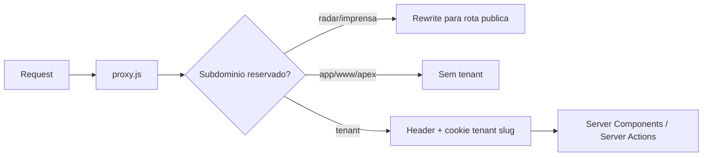

# Refatoracao Arquitetural - Sugestoes

> Data: 2026-06-19  
> Escopo: diagnostico tecnico e plano de melhoria de qualidade para o Vertho App.  
> Principio: manter a funcionalidade atual, reduzir risco operacional e aumentar manutenibilidade.

---

## 1. Resumo Executivo

O Vertho App e um SaaS B2B multi-tenant em Next.js App Router, com Supabase/Postgres, Supabase Auth, Vercel, Resend, Z-API, QStash, geracao de PDF e varios pipelines de IA.

A arquitetura atual ja tem boas bases:

- Guardas de autenticacao e autorizacao centralizados em `lib/auth/`.
- Wrapper `tenantDb()` para injetar `empresa_id`.
- Allowlist auditavel para usos de `createSupabaseAdmin()`.
- Testes de seguranca cobrindo rotas, tenant isolation, CSRF e service role.
- Documentacao arquitetural extensa em `ARQUITETURA.md`, `RESUMO.md` e `docs/service-role-allowlist.md`.

Os principais riscos hoje nao parecem ser de "falta de arquitetura", mas de crescimento organico:

- Muita logica critica vive em arquivos muito grandes.
- Fluxos semelhantes foram reimplementados em lugares diferentes.
- O uso de `service_role` ainda e amplo.
- Regras de produto ficam espalhadas entre API routes, server actions e UI.
- Alguns processos pesados misturam consulta ao banco, IA, renderizacao de PDF, storage e envio no mesmo bloco.

O plano recomendado e incremental: primeiro consolidar infraestrutura duplicada e regras compartilhadas, depois atacar arquivos grandes e migracoes de dados mais sensiveis.

---

## 2. Mapa de Arquitetura Atual

### 2.1 Entrada e Tenancy

Arquivo principal: `proxy.js`

Responsabilidades:

- Detecta host/subdominio.
- Reescreve subdominios publicos:
  - `radar.vertho.ai` -> `/radar`
  - `imprensa.vertho.ai` -> `/imprensa`
- Redireciona `radarbett.vertho.ai`.
- Para tenants, injeta:
  - header `x-tenant-slug`
  - cookie `vertho-tenant-slug`

Fluxo esperado:



### 2.2 Autenticacao e Autorizacao

Arquivos principais:

- `lib/authz.ts`
- `lib/auth/action-context.ts`
- `lib/auth/request-context.ts`
- `lib/permissions.ts`
- `lib/admin-supabase.ts`

Conceitos:

- `platform_admins`: acesso global ao admin.
- `colaboradores.role`: papel por tenant (`colaborador`, `gestor`, `rh`, `tutor`, etc.).
- `findColabByEmail()` resolve colaborador respeitando tenant quando possivel.
- Sem tenant resolvido e e-mail duplicado em empresas, o sistema falha fechado.

### 2.3 Dados

Arquivos principais:

- `lib/supabase.ts`
- `lib/tenant-db.ts`
- `migrations/`

Padrao atual:

- `createSupabaseAdmin()` cria client com `SUPABASE_SERVICE_ROLE_KEY`.
- `tenantDb(empresaId)` embrulha `createSupabaseAdmin()` e injeta `empresa_id` em `select`, `insert`, `upsert`, `update` e `delete`.
- Algumas rotas/actions usam `createSupabaseAdmin()` diretamente por necessidade cross-tenant, storage, auth admin ou historico.

### 2.4 Modulos de Produto

Pastas principais:

- `app/dashboard/`: colaborador, gestor, RH.
- `app/admin/`: plataforma administrativa.
- `app/radar/`: site publico Radar.
- `actions/`: pipelines e operacoes de negocio.
- `lib/season-engine/`: motor de temporadas.
- `lib/radar/`: consultas/importadores/narrativas do Radar.
- `components/pdf/` e libs de PDF: renderizacao de relatorios.

### 2.5 IA, PDF e Envios

Arquivos e areas:

- `actions/ai-client.ts`: roteador Claude/Gemini/OpenAI.
- `actions/fase*.ts`: pipelines IA principais.
- `actions/conteudos.ts`: conteudo, PDF, personalizacao.
- `app/api/auth/magic-link/route.ts`, `app/api/auth/signup/route.ts`, `actions/pulse/envio.ts`, `app/admin/whatsapp/actions.ts`: envios por Resend/Z-API.
- `lib/zapi.ts`: status/config basica da Z-API.

---

## 3. Areas Problematicas

### 3.1 Uso amplo de service role

Sintoma:

- Ha muitos usos de `createSupabaseAdmin()`.
- Existe allowlist, mas o volume ainda aumenta o risco de bypass acidental de tenant/RLS.

Riscos:

- Vazamento cross-tenant se faltar filtro `empresa_id`.
- Rotas user-scoped ficam dependentes de disciplina manual.
- Refactors pequenos podem introduzir falhas grandes.

Observacao positiva:

- O projeto ja tem `config/service-role-allowlist.json` e testes estruturais. Isso e uma boa trava de seguranca.

Recomendacao:

- Nao tentar remover `service_role` de uma vez.
- Priorizar rotas user-scoped de dashboard/assessment/temporada.
- Criar repositorios tenant-safe para acessos comuns.

---

### 3.2 Arquivos grandes demais

Hotspots identificados:

| Arquivo | Tamanho aproximado | Risco |
|---|---:|---|
| `actions/fase5.ts` | 1800+ linhas | Alto |
| `actions/fase1.ts` | 1400+ linhas | Alto |
| `lib/radar/queries.ts` | 1400+ linhas | Alto |
| `actions/modulos-base.ts` | 1100+ linhas | Alto |
| `actions/conteudos.ts` | 1000+ linhas | Alto |
| `actions/temporadas.ts` | 700+ linhas | Medio/alto |
| `actions/relatorios.ts` | 700+ linhas | Medio/alto |

Riscos:

- Mudancas pequenas exigem entender muito contexto.
- Testabilidade baixa por funcao muito acoplada.
- Maior chance de duplicacao e regressao.
- Dificuldade de ownership por dominio.

Recomendacao:

- Extrair por caso de uso, nao por tipo tecnico.
- Manter exports publicos existentes inicialmente, delegando para modulos novos.

Exemplo:

```txt
actions/fase5.ts
  -> actions/fase5/cenarios-b.ts
  -> actions/fase5/reavaliacao.ts
  -> actions/fase5/relatorios-evolucao.ts
  -> actions/fase5/plenaria.ts
  -> actions/fase5/links.ts
```

---

### 3.3 Duplicacao de envio de link/e-mail/WhatsApp

Locais com logica relacionada:

- `app/api/auth/magic-link/route.ts`
- `app/api/auth/signup/route.ts`
- `app/api/auth/magic-link-whatsapp/route.ts`
- `app/api/auth/phone-magic-link/request/route.ts`
- `actions/pulse/envio.ts`
- `actions/fase2.ts`
- `actions/fase5.ts`
- `app/admin/whatsapp/actions.ts`
- `actions/whatsapp.ts`
- `actions/whatsapp-lote.ts`

Sintoma:

- Varias implementacoes geram magic link, montam callback, chamam Resend, chamam Z-API e tratam erros de formas diferentes.

Bug real observado:

- `juliane@vertho.ai` caia em sucesso silencioso porque era platform admin e tambem estava duplicada como colaboradora em dois tenants.

Riscos:

- Inconsistencia de comportamento.
- Mensagem "enviado" sem envio real.
- Dificuldade de auditar falhas.
- Duplicacao de templates, URLs e tratamento de provider.

Recomendacao:

- Criar um servico unico de links de acesso e notificacoes.

Proposta:

```txt
lib/auth/magic-link-service.ts
lib/notifications/email-service.ts
lib/notifications/whatsapp-service.ts
lib/notifications/access-link-service.ts
```

---

### 3.4 Regras de produto espalhadas

Exemplos:

- Liberacao de perfil comportamental.
- Liberacao de mapeamento de cenarios.
- Votacao ativa/inativa.
- Escolha do cenario por cargo, competencia, escola e PPP.
- Gate de temporada/trilha/praticar/PDI.

Sintoma:

- Uma regra aparece em `lib/votacao/status.ts`, dashboard, API routes e server actions.

Bug real observado:

- Empresa com `mapeamento_cenarios_liberado` ausente ou inconsistente bloqueava usuarios com perfil pronto e cenarios disponiveis.

Recomendacao:

- Criar camada de "gates" de produto.

Proposta:

```txt
lib/access-gates/perfil-comportamental.ts
lib/access-gates/mapeamento-cenarios.ts
lib/access-gates/temporada.ts
lib/access-gates/pdi.ts
```

Esses gates devem retornar objetos explicitos:

```ts
type GateResult =
  | { allowed: true }
  | { allowed: false; code: string; message: string; remediation?: string };
```

---

### 3.5 Rate limit em memoria

Arquivo:

- `lib/rate-limit.ts`

Estado atual:

- Usa `Map` em memoria por instancia serverless.

Ponto positivo:

- Simples e ja protege abusos obvios na mesma instancia quente.

Limite:

- Nao e distribuido.
- Em Vercel, multiplas lambdas podem ter contadores diferentes.
- Para auth, IA e WhatsApp, o custo financeiro e risco de abuso pedem limite distribuido.

Recomendacao:

- Migrar `authLimiter`, `aiLimiter` e rotas de WhatsApp para Upstash Redis/Ratelimit.
- Manter fallback in-memory para desenvolvimento local.

---

### 3.6 TypeScript permissivo

Arquivo:

- `tsconfig.json`

Estado atual:

```json
{
  "strict": false,
  "allowJs": true,
  "checkJs": false,
  "skipLibCheck": true
}
```

Riscos:

- Payloads de IA e Supabase chegam como `any`.
- Erros de schema aparecem em runtime.
- Refactors ficam menos confiaveis.

Recomendacao incremental:

1. Manter `strict: false` global por enquanto.
2. Criar `types/db.ts` ou integrar tipos gerados do Supabase.
3. Ativar `noImplicitAny` apenas em modulos novos.
4. Migrar `lib/auth`, `lib/access-gates`, `lib/notifications` com tipos fortes.

---

### 3.7 Processos pesados sincronos

Sintoma:

- Muitos fluxos misturam:
  - consulta ao banco
  - chamada IA
  - parse/validacao
  - upload storage
  - envio e-mail/WhatsApp
  - atualizacao de status

Riscos:

- Timeout em serverless.
- Retentativas parciais duplicam dados.
- Falhas intermediarias deixam estados inconsistentes.
- Dificil observar progresso real.

Recomendacao:

- Para lotes: usar jobs com status persistido.
- Para IA/PDF: separar "request", "processing" e "finalize".
- Para envios: registrar tentativa, provider, resposta e erro estruturado.

---

### 3.8 Deploy operacional

Documento `RESUMO.md` indica:

- Deploy deveria acontecer via `git push origin master`.
- Evitar `vercel --prod` direto para nao duplicar deploys.

Risco observado:

- Deploy manual via CLI pode publicar working tree com mudancas locais nao relacionadas.

Recomendacao:

- Formalizar:
  - hotfix emergencial via CLI permitido apenas com checklist.
  - caminho normal via Git.
  - pre-deploy: `git status`, `npm run typecheck`, smoke essencial.

---

## 4. Estrategia de Refatoracao Recomendada

### Fase 1 - Baixo risco, alto retorno

Objetivo: reduzir duplicacao e bugs recorrentes sem mudar comportamento.

Itens:

1. Extrair servico unico de magic link.
2. Extrair servico unico de Resend.
3. Extrair servico unico de WhatsApp/Z-API.
4. Criar gates de produto para perfil/cenarios.
5. Adicionar testes unitarios para esses servicos.

Arquivos candidatos:

```txt
lib/auth/magic-link-service.ts
lib/notifications/email-service.ts
lib/notifications/whatsapp-service.ts
lib/notifications/access-link-service.ts
lib/access-gates/mapeamento-cenarios.ts
lib/access-gates/perfil-comportamental.ts
```

Resultado esperado:

- Menos duplicacao.
- Menos bugs de "link enviado mas nao enviado".
- Regras de liberacao previsiveis.

---

### Fase 2 - Tenant safety

Objetivo: reduzir uso direto de `service_role` em fluxos user-scoped.

Itens:

1. Criar repositorios para entidades principais:

```txt
lib/repositories/colaboradores-repo.ts
lib/repositories/empresas-repo.ts
lib/repositories/assessment-repo.ts
lib/repositories/temporadas-repo.ts
lib/repositories/relatorios-repo.ts
```

2. Migrar primeiro:

- `app/dashboard/dashboard-actions.ts`
- `app/dashboard/assessment/assessment-actions.ts`
- `app/api/assessment/route.ts`
- `app/api/chat/route.ts`

3. Preservar guards existentes.

Resultado esperado:

- Menor blast radius do service role.
- Queries mais padronizadas.
- Mais facil revisar seguranca.

---

### Fase 3 - Quebra dos arquivos grandes

Objetivo: melhorar manutenibilidade sem trocar comportamento.

Prioridade:

1. `actions/fase5.ts`
2. `actions/fase1.ts`
3. `actions/conteudos.ts`
4. `lib/radar/queries.ts`

Metodo:

- Manter o arquivo original como facade temporaria.
- Mover funcoes internas por dominio.
- Preservar exports publicos.
- Testar antes/depois com typecheck e smoke.

Exemplo:

```ts
// actions/fase5.ts
export { gerarCenariosBLote } from './fase5/cenarios-b';
export { iniciarReavaliacaoLote } from './fase5/reavaliacao';
export { gerarRelatoriosEvolucaoLote } from './fase5/relatorios-evolucao';
```

---

### Fase 4 - Observabilidade e jobs

Objetivo: tornar processos pesados mais confiaveis.

Itens:

- Criar tabela/servico de job status padrao.
- Padronizar logs estruturados.
- Registrar tentativas de envio.
- Registrar custo/tempo de IA por chamada.
- Migrar rate limit distribuido.

---

### Fase 5 - TypeScript e schema

Objetivo: aumentar confianca dos refactors.

Itens:

- Gerar tipos Supabase.
- Tipar payloads de IA com Zod.
- Ativar regras TS por modulo novo.
- Reduzir `any` em `lib/auth`, `lib/notifications`, `lib/access-gates`.

---

## 5. Codigo Melhorado Proposto

### 5.1 Servico de magic link

```ts
// lib/auth/magic-link-service.ts
import { createSupabaseAdmin } from '@/lib/supabase';

export async function createMagicCallbackLink(params: {
  email: string;
  redirectTo: string;
  nextPath: string;
}) {
  const sb = createSupabaseAdmin();
  const { email, redirectTo, nextPath } = params;

  const { data, error } = await sb.auth.admin.generateLink({
    type: 'magiclink',
    email,
    options: { redirectTo },
  });

  if (error || !data?.properties?.hashed_token) {
    throw new Error(error?.message || 'Token de magic link nao gerado');
  }

  const origin = new URL(redirectTo).origin;

  return `${origin}/auth/callback?token_hash=${encodeURIComponent(
    data.properties.hashed_token,
  )}&type=email&next=${encodeURIComponent(nextPath)}`;
}
```

### 5.2 Servico de e-mail

```ts
// lib/notifications/email-service.ts
import { Resend } from 'resend';
import { EMAIL_FROM_DEFAULT } from '@/lib/domain';

export async function sendHtmlEmail(params: {
  to: string;
  subject: string;
  html: string;
}) {
  if (!process.env.RESEND_API_KEY) {
    throw new Error('RESEND_API_KEY ausente');
  }

  const resend = new Resend(process.env.RESEND_API_KEY);
  const result = await resend.emails.send({
    from: EMAIL_FROM_DEFAULT,
    to: params.to,
    subject: params.subject,
    html: params.html,
  });

  if ((result as any).error) {
    throw new Error(JSON.stringify((result as any).error));
  }

  return result.data;
}
```

### 5.3 Servico de link de acesso

```ts
// lib/notifications/access-link-service.ts
import { magicLinkEmail, magicLinkWhatsapp } from '@/lib/i18n-auth-templates';
import { createMagicCallbackLink } from '@/lib/auth/magic-link-service';
import { sendHtmlEmail } from './email-service';
import { sendWhatsappText } from './whatsapp-service';

export async function sendAccessLink(params: {
  email: string;
  telefone?: string | null;
  nome: string;
  empresaNome: string;
  locale: string;
  redirectTo: string;
  nextPath: string;
  channels: Array<'email' | 'whatsapp'>;
}) {
  const link = await createMagicCallbackLink({
    email: params.email,
    redirectTo: params.redirectTo,
    nextPath: params.nextPath,
  });

  const result = { email: false, whatsapp: false, link };

  if (params.channels.includes('email')) {
    const template = magicLinkEmail(params.locale as any, {
      nome: params.nome,
      empresaNome: params.empresaNome,
      link,
    });
    await sendHtmlEmail({
      to: params.email,
      subject: template.subject,
      html: template.html,
    });
    result.email = true;
  }

  if (params.channels.includes('whatsapp') && params.telefone) {
    const message = magicLinkWhatsapp(params.locale as any, {
      nome: params.nome,
      empresaNome: params.empresaNome,
      link,
    });
    await sendWhatsappText(params.telefone, message);
    result.whatsapp = true;
  }

  return result;
}
```

### 5.4 Gate de mapeamento de cenarios

```ts
// lib/access-gates/mapeamento-cenarios.ts
export type GateResult =
  | { allowed: true }
  | { allowed: false; code: string; message: string; remediation?: string };

export function canAccessMapeamentoCenarios(config: any): GateResult {
  if (config?.votacao_ativa === true) {
    return {
      allowed: false,
      code: 'VOTACAO_ATIVA',
      message: 'O mapeamento de cenarios sera liberado apos o fechamento da votacao.',
    };
  }

  if (config?.perfil_comportamental_liberado === false) {
    return {
      allowed: false,
      code: 'PERFIL_BLOQUEADO',
      message: 'O perfil comportamental ainda nao foi liberado pela empresa.',
      remediation: 'Libere o perfil comportamental antes dos cenarios.',
    };
  }

  if (config?.mapeamento_cenarios_liberado !== true) {
    return {
      allowed: false,
      code: 'CENARIOS_BLOQUEADOS',
      message: 'O mapeamento de cenarios ainda nao foi liberado pela empresa.',
      remediation: 'Ative mapeamento_cenarios_liberado no painel administrativo.',
    };
  }

  return { allowed: true };
}
```

---

## 6. Plano de Execucao Sugerido

### Sprint 1

- Criar servicos de magic link/e-mail/WhatsApp.
- Migrar:
  - `app/api/auth/magic-link/route.ts`
  - `app/api/auth/signup/route.ts`
  - `app/api/auth/magic-link-whatsapp/route.ts`
- Criar testes unitarios para:
  - platform admin sem tenant
  - colaborador com tenant
  - e-mail duplicado em tenants
  - Resend indisponivel
  - Z-API indisponivel

### Sprint 2

- Criar gates de produto.
- Migrar:
  - `lib/votacao/status.ts`
  - `app/api/assessment/route.ts`
  - `app/api/chat/route.ts`
  - `app/dashboard/assessment/assessment-actions.ts`
  - `app/dashboard/dashboard-actions.ts`

### Sprint 3

- Criar repositories tenant-safe para dashboard e assessment.
- Reduzir `createSupabaseAdmin()` nas rotas user-scoped.
- Atualizar allowlist.

### Sprint 4

- Quebrar `actions/fase5.ts` em modulos.
- Manter exports publicos.
- Rodar regressao de admin pipeline.

### Sprint 5

- Migrar rate limiting para Upstash.
- Registrar tentativas de envio com provider/status/erro.

---

## 7. Criterios de Aceite

Antes de considerar cada fase concluida:

- `npm run typecheck` passa.
- Testes unitarios relevantes passam.
- Fluxos criticos manuais:
  - login magic link admin
  - login magic link tenant
  - dashboard colaborador
  - assessment/cenarios
  - envio WhatsApp em ambiente controlado
- Nenhum novo uso de `createSupabaseAdmin()` fora da allowlist.
- Nenhuma mudanca funcional intencional sem aprovacao.

---

## 8. Prioridade Recomendada

Ordem sugerida:

1. **Unificar magic link/Resend/Z-API**  
   Motivo: bug real recente, alta duplicacao, baixo risco de refactor.

2. **Centralizar gates de produto**  
   Motivo: bug real recente em liberacao de mapeamento.

3. **Tenant-safe repositories para fluxos user-scoped**  
   Motivo: reduz risco cross-tenant.

4. **Quebrar arquivos grandes**  
   Motivo: melhora manutenibilidade, mas exige mais cuidado.

5. **Rate limit distribuido**  
   Motivo: protege custo e abuso em producao.

6. **TypeScript gradual**  
   Motivo: aumenta confianca, mas deve ser incremental.

---

## 9. Observacoes Finais

Este plano evita reescrever o sistema. A melhor abordagem e preservar o comportamento atual e mover responsabilidades para lugares mais previsiveis.

O codigo ja tem bons sinais de maturidade: testes de seguranca, allowlist de service role, documentacao e guardas centralizados. O proximo salto de qualidade e transformar esses guardrails em APIs internas mais ergonomicas, para que o caminho seguro seja tambem o caminho mais facil.

